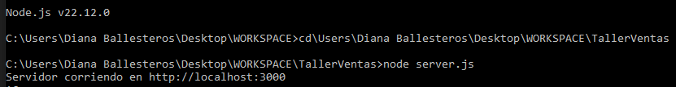

TALLER DE FORMULARIO DE VENTAS Y REGISTROS

Este proyecto es una aplicación sencilla para gestionar el registro de ventas, fue desarrollado como parte de un taller. Incluye un frontend (lo cual es la parte del formulario y su tabla para mostrar los registros) y un backend (que se basa en el servidor con Node.js y Express).

ESTRUCTURA DEL PROYECTO: 

index.html: Archivo principal del frontend, contiene el formulario y la tabla.
server.js: Archivo principal del backend, define las rutas y lógica del servidor. 
package.json: Archivo de configuración del proyecto, ingluyendo dependencias. 
node_modules/: Dependencias instaladas por npm.
Readme.md: Documentación del proyecto. 

DESCRIPCIÓN DE LOS ARCHIVOS: 

1. Frontend (index.html)

Este archivo contiene: 
- Un formulario para ingresar datos de ventas como (cantidad, precio y descripción del producto).
- Una tabla dinámica que permite mostrar los registros con sus subtotales, IVA y total. 
- Código de JavaScript que envía datos al backend y actualiza la tabla con los registros almacenados en el servidor. 

2. Backend (server.js)

Este archivo configura lo siguiente: 
- Un servidor Express para manejar las solicitudes HTTP. 
- Rutas GET, POST y como extra DELETE para poder listar, agregar y eliminar los regstros.
- Almacenamiento de registros en memoria y cálculo automático de subtotales, IVA y total. 

3. Dependencias (package.json)

Las dependencas del proyecto incluyen: 
- express: Un framework para manejar el servidor.
- body-parser: Middleware para poder procesar solicitudes JSON.
- cors: Permiten solicitudes desde diferentes dominios.

Instalación:

Prueba de que funciona el servidor: 

INSTRUCCIONES PARA EJECUTAR: 

Requisitos:
- Tener instalado Node.js (última versión).
- Un navegador web (como Google Chrome para pruebas).

Pasos: 

1. Instalar dependencias necesarias (rpm install)
2. Iniciar el servidor (node server.js)
En este caso, se instaló previamente (nodemon) que permite que el servidor se actualice automáticamente con algún cambio generado en el código. 
Por lo tanto, tambien se lo puede llamar para reiniciarlo con (nodemon server.js).
3. Accede a la aplicación por medio de un navegador web y en la barra de direcciones coloca http://localhost:3000

CARACTERÍSTICAS: 

1. Formulario: 
- Permite ingresar cantidad, precio y descripción del producto. 
- Valida que los campos no estén vacíos y que los valores sean positivos.

2. Tabla de Registros: 
- Muestra los registros ingresados con los cálculos: 
    - Subtotal (cantidad*precio).
    - IVA (12% del subtotal).
    - Total(subtotal + IVA).
- Se incluyó un botón para eliminar los registros y se pueda actualizar la tabla. 

3. Limites y validaciones: 
- El número máximo de registros es 10. Si se intentan agregar más, se mostrará por pantalla un mensaje de error.

CAPTURAS DE PANTALLA DE FUNCIONAMIENTO:

Nota: Realizado por Diana Ballesteros, este documento se realizó para mantener una guía e introducción del ejercicio. 